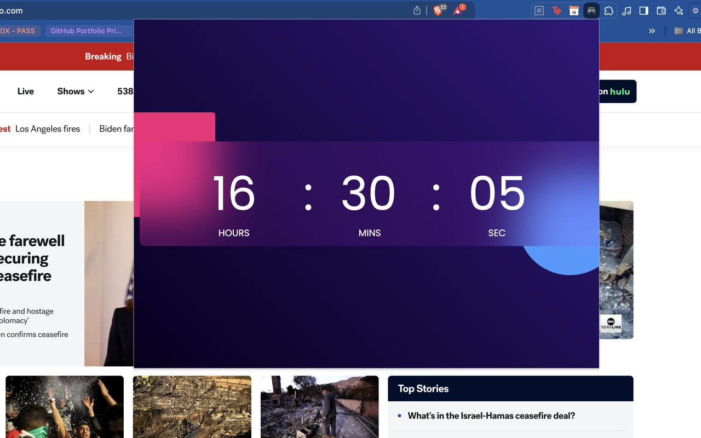

# Digital Clock

## v1.1.0

## Made in JavaScript

## Can also be a Google Chrome Browser Extension by using the `manifest.json` file

### This was taken from [this YouTube instructional video on making a JavaScript Digital Clock](https://www.youtube.com/watch?v=5tC46h022YE) by [GreatStack](https://www.youtube.com/@GreatStackDev). See also [GreatStack's web site here](https://greatstack.dev/)

I have taken this code and adjusted the CSS and such and added a manifest.json and icon files to make it into a Google Chrome Browser extension.

If you need help this, or have issues or want to do your own PR, please write me at `my  [underscore sign]  biz  [at sign]  me  [dot]  com`.
